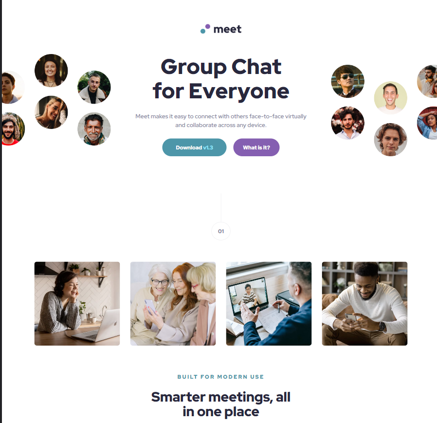

# Frontend Mentor - Meet Landing Page solution

This is a solution to the [Meet Landing Page challenge on Frontend Mentor](https://www.frontendmentor.io/challenges/meet-landing-page-rbTDS6OUR). Frontend Mentor challenges help you improve your coding skills by building realistic projects. 

## Table of contents

- [Overview](#overview)
  - [Screenshot](#screenshot)
  - [Links](#links)
- [My process](#my-process)
  - [Built with](#built-with)
- [Author](#author)

## Overview

### Screenshot

### Links
- Solution URL: [Source code](https://github.com/cwasi/meet-landing-page)
- Live Site URL: [Live site](https://cwasi-meet-landing-page.netlify.app/)

## My process

### Built with

- HTML5
- CSS
- SCSS

## Author

- Frontend Mentor - [@cwasi](https://www.frontendmentor.io/profile/cwasi)
- GitHub - [@cwasi](https://github.com/cwasi)

## Getting Started

- run `npm install` or `npm i` to install all dependencies
- run `npm start` to run the server

### Prerequisites:

- Live Server Extension